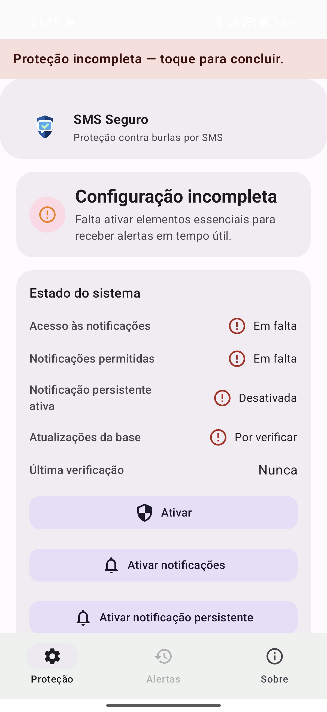
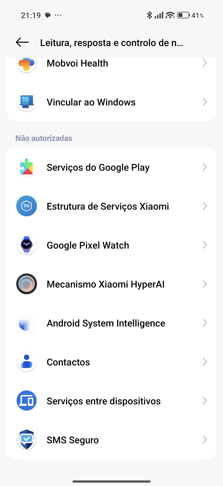
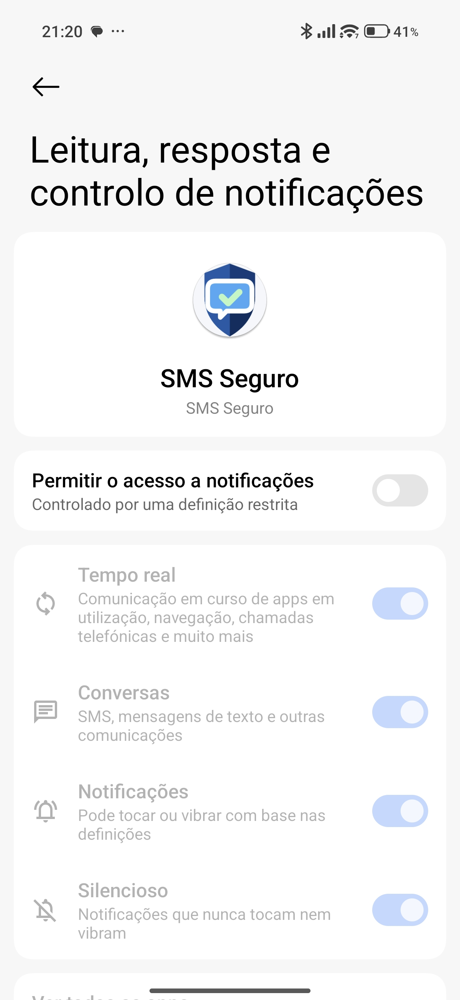
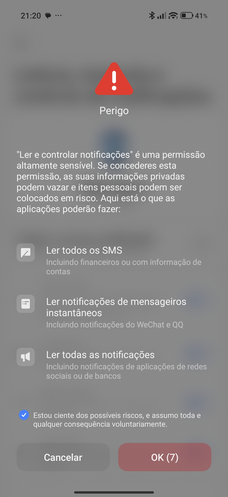
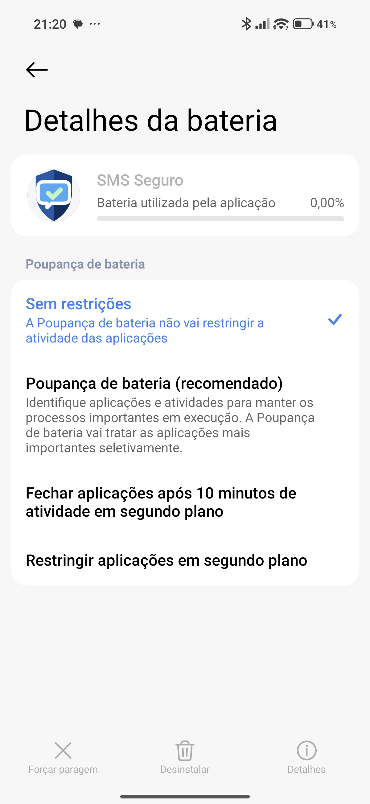
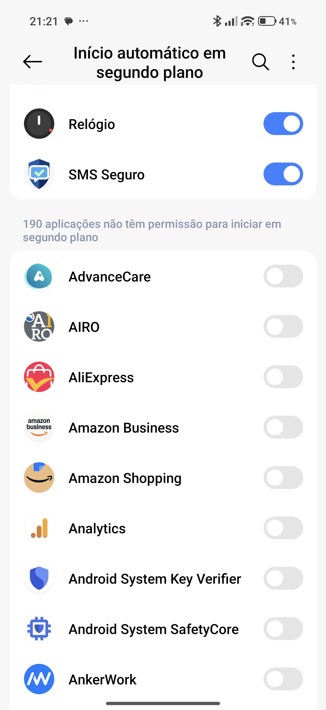
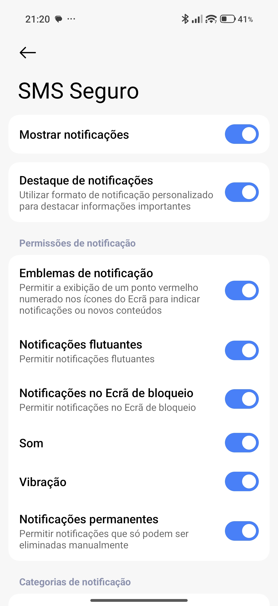
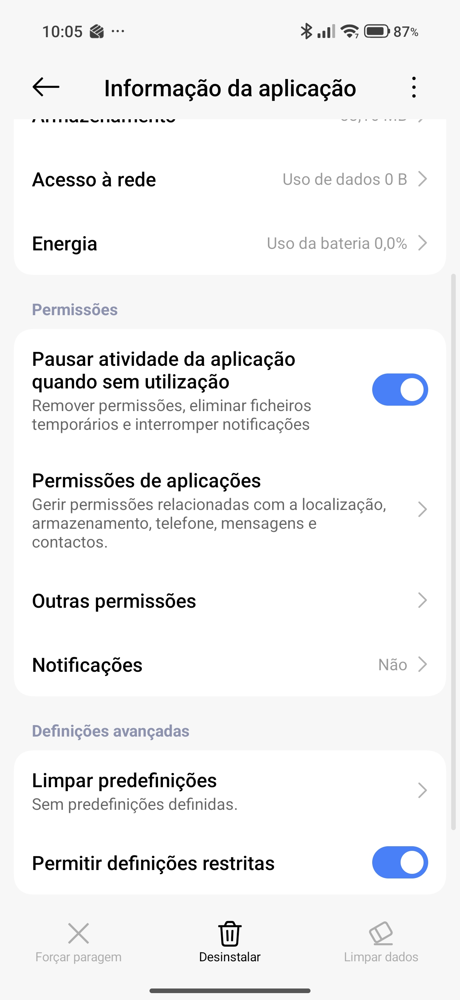

# Ativar Protecao no Xiaomi

Guia curto, escrito para quem quer ativar a protecao sem medo.

## Antes de comecar

O Xiaomi pode mostrar um aviso do sistema com a palavra "Perigo".
Esse aviso e normal neste passo.
O SMS Seguro precisa desta permissao para conseguir ler notificacoes de SMS e avisar a tempo.

## Como ativar

### 1. Abra a app e toque em `Ativar`

Se a protecao estiver incompleta, toque no botao principal `Ativar`.

### 2. No ecrã do sistema, procure "SMS Seguro"

Vai abrir a lista de apps com acesso a notificacoes.
Procure `SMS Seguro`.

### 3. Ative "Ler notificacoes"

Toque em `SMS Seguro` e depois ative o interruptor principal.
Se aparecer um aviso com "Perigo", continue.

### 4. Volte para a app

Quando voltar, a app deve deixar de mostrar falhas nos itens principais.
Tambem deve aparecer a notificacao persistente do SMS Seguro.

## Xiaomi / MIUI: o que mais deve verificar

Sem isto, a MIUI pode desligar a protecao.

### Bateria

Defina a bateria do SMS Seguro como `Sem restricoes`.

### Auto-start

Ative `Auto-start`, se existir no seu modelo.

### Notificacoes da app

Confirme que `Mostrar notificacoes` e `Notificacoes permanentes` estao ativas.

### Permissoes restritas

Se o seu modelo mostrar `Definicoes restritas`, permita esta opcao.

Caminho habitual:

`Definicoes -> Apps -> SMS Seguro -> Permissoes -> Definicoes restritas`

## Se algo falhar

1. Confirme que `Acesso às notificações` esta ativo.
2. Confirme que `Notificacoes permitidas` esta ativo.
3. Confirme que `Notificacao persistente ativa` esta visivel.
4. Volte a abrir a secao Xiaomi / MIUI e toque nos botoes.

## Screenshots usados neste guia

- `docs/images/xiaomi/01-protecao-incompleta.jpg`
- `docs/images/xiaomi/02-lista-apps.jpg`
- `docs/images/xiaomi/03-detalhe-sms-seguro.jpg`
- `docs/images/xiaomi/04-aviso-perigo.jpg`
- `docs/images/xiaomi/05-definicoes-notificacoes-app.jpg`
- `docs/images/xiaomi/06-autostart.jpg`
- `docs/images/xiaomi/07-bateria-sem-restricoes.jpg`
- `docs/images/xiaomi/08-definicoes-restritas.jpg`
